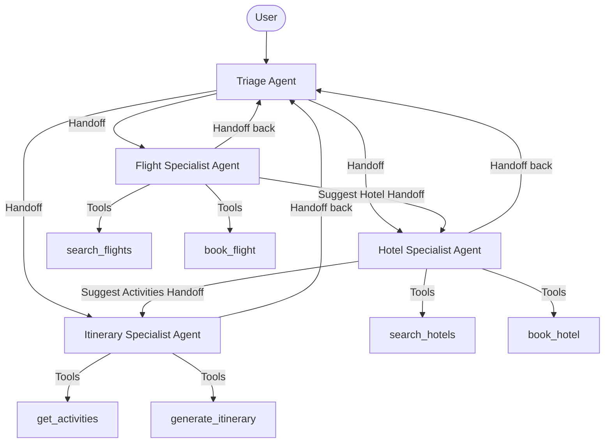

# OpenAI Agents SDK: Travel Agent Schema & Flow Design

This document details the architecture, schemas, and implementation flow for a multi-agent **Travel Agent** system built using the `openai-agents` Python SDK.

## 1. Multi-Agent Conversation Flow

The system employs a **Triage & Specialist** pattern. The **Triage Agent** is the entry point, routing the conversation to specialists based on user intent. Specialists can also hand off to one another (e.g., once flights are booked, suggesting a hotel booking).



---

## 2. Structured Data Schemas (Pydantic)

Pydantic models are used to define structured arguments for agent tools, ensuring runtime type safety and clear schema descriptions for the LLM.

```python
from pydantic import BaseModel, Field
from typing import Optional, List
from datetime import date

class TripContext(BaseModel):
    """Overall state context of the trip."""
    origin: str = Field(..., description="Departure city or airport code (e.g., NYC)")
    destination: str = Field(..., description="Destination city or airport code (e.g., PAR)")
    departure_date: date = Field(..., description="Departure date in YYYY-MM-DD format")
    return_date: Optional[date] = Field(None, description="Return date in YYYY-MM-DD format")
    num_travelers: int = Field(default=1, ge=1, description="Number of travelers")
    budget: Optional[float] = Field(None, description="Estimated total budget for the trip")

class FlightBookingRequest(BaseModel):
    """Schema for selecting and booking a flight."""
    flight_id: str = Field(..., description="Unique identifier for the selected flight option")
    seat_preference: str = Field("window", description="Window, Aisle, or Middle seat preference")
    meal_preference: Optional[str] = Field(None, description="Special dietary meals requested")

class HotelBookingRequest(BaseModel):
    """Schema for selecting and booking a hotel room."""
    hotel_id: str = Field(..., description="Unique identifier for the selected hotel option")
    room_type: str = Field("standard", description="Standard, Deluxe, or Suite")
    include_breakfast: bool = Field(default=False, description="Whether breakfast should be included")
```

---

## 3. Python Implementation (OpenAI Agents SDK)

Below is the complete blueprint showing how to define the agents, instructions, tools, and handoffs.

```python
import asyncio
from typing import List, Dict, Any
from datetime import date
from pydantic import BaseModel, Field
from agents import Agent, Runner, handoff

# ==========================================
# 1. Mock Database / Tool Functions
# ==========================================

async def search_flights(origin: str, destination: str, departure_date: str) -> List[Dict[str, Any]]:
    """
    Search for available flights based on origin, destination, and departure date.
    """
    print(f"[Tool] Searching flights from {origin} to {destination} on {departure_date}...")
    return [
        {"flight_id": "AA-101", "airline": "American Airlines", "price": 450.00, "time": "08:00 AM"},
        {"flight_id": "DL-202", "airline": "Delta Air Lines", "price": 480.00, "time": "11:30 AM"},
    ]

async def book_flight(booking: FlightBookingRequest) -> Dict[str, Any]:
    """
    Book a selected flight using a FlightBookingRequest schema.
    """
    print(f"[Tool] Booking flight {booking.flight_id} ({booking.seat_preference} seat)...")
    return {
        "status": "success",
        "booking_reference": "FL-XYZ987",
        "flight_id": booking.flight_id,
        "message": "Flight booked successfully!"
    }

async def search_hotels(location: str, checkin: str, checkout: str, guests: int) -> List[Dict[str, Any]]:
    """
    Search for hotels at the destination location.
    """
    print(f"[Tool] Searching hotels in {location} ({checkin} to {checkout}) for {guests} guests...")
    return [
        {"hotel_id": "HT-Grand", "name": "Grand Palace Hotel", "price_per_night": 180.00, "rating": 4.8},
        {"hotel_id": "HT-Cozy", "name": "Cozy Stay Inn", "price_per_night": 95.00, "rating": 4.2},
    ]

async def book_hotel(booking: HotelBookingRequest) -> Dict[str, Any]:
    """
    Book a selected hotel room using a HotelBookingRequest schema.
    """
    print(f"[Tool] Booking hotel {booking.hotel_id} ({booking.room_type} room)...")
    return {
        "status": "success",
        "booking_reference": "HT-ABC123",
        "hotel_id": booking.hotel_id,
        "message": "Hotel room reserved successfully!"
    }

async def get_activities(city: str, interests: List[str]) -> List[str]:
    """
    Get recommended activities in a city tailored to user interests.
    """
    print(f"[Tool] Finding activities in {city} related to {interests}...")
    return [
        f"Guided historical walking tour of {city}",
        f"Visit the famous local museum / art gallery",
        f"Dine at a top-rated restaurant specializing in local cuisine"
    ]

# ==========================================
# 2. Agent Definitions & Orchestration
# ==========================================

# A. Specialized Agents
flight_agent = Agent(
    name="Flight Specialist",
    instructions=(
        "You are an expert flight assistant. Help the user search for flights and book them. "
        "Use the search_flights tool first. Once the user selects a flight, use the book_flight tool. "
        "After booking a flight, hand off the user to the Hotel Specialist if they need accommodation, "
        "otherwise return control to the Triage Agent."
    ),
    tools=[search_flights, book_flight],
)

hotel_agent = Agent(
    name="Hotel Specialist",
    instructions=(
        "You are an expert hotel assistant. Help the user search for hotels and make bookings. "
        "Use search_hotels to find matches. Use book_hotel to book a room. "
        "After reserving a hotel, hand off the user to the Itinerary Specialist if they want to plan activities, "
        "otherwise return control to the Triage Agent."
    ),
    tools=[search_hotels, book_hotel],
)

itinerary_agent = Agent(
    name="Itinerary Specialist",
    instructions=(
        "You are a local guide and itinerary planner. Help the user find activities, "
        "restaurants, and custom daily schedules using the get_activities tool. "
        "When finished, return control to the Triage Agent."
    ),
    tools=[get_activities],
)

# B. Central Router Agent
triage_agent = Agent(
    name="Triage Concierge",
    instructions=(
        "You are the central concierge for a premium travel agency. "
        "Your job is to greet the user, understand their overall travel goals (destination, dates, budget), "
        "and delegate the user to the appropriate specialist:\n"
        "- Hand off to Flight Specialist for flight searches, flight options, or booking flights.\n"
        "- Hand off to Hotel Specialist for lodging, hotel searches, or booking hotel rooms.\n"
        "- Hand off to Itinerary Specialist for activity recommendations, sights, and planning schedules.\n\n"
        "Be warm and polite. If a user asks a general question, answer it, but route them as soon as they have a specific intent."
    ),
    # Declarative Handoff connections
    handoffs=[flight_agent, hotel_agent, itinerary_agent]
)

# C. Connect cross-delegations between specialists
flight_agent.handoffs = [hotel_agent, triage_agent]
hotel_agent.handoffs = [itinerary_agent, triage_agent]
itinerary_agent.handoffs = [triage_agent]

# ==========================================
# 3. Running the Multi-Agent Loop
# ==========================================

async def main():
    print("--- Starting Travel Agent Simulation ---")
    
    # Simulate a conversation
    session_messages = []
    
    # Turn 1: User request
    user_input = "Hi! I want to plan a trip to Paris. Can you help me find flights from NYC on July 10th?"
    print(f"\nUser: {user_input}")
    
    # Run the triage agent (which will immediately delegate to Flight Specialist)
    result = await Runner.run(triage_agent, user_input, history=session_messages)
    print(f"Agent ({result.last_agent.name}): {result.final_output}")
    
    # Save conversation state
    session_messages = result.history
    
    # Turn 2: User books flight
    user_input = "Perfect, let's book flight AA-101. I prefer a window seat."
    print(f"\nUser: {user_input}")
    
    # The runner automatically routes to the active agent (Flight Specialist)
    result = await Runner.run(result.last_agent, user_input, history=session_messages)
    print(f"Agent ({result.last_agent.name}): {result.final_output}")
    
    # Save conversation state
    session_messages = result.history

    # Turn 3: Hand off to Hotel
    user_input = "Awesome! Now let's look for a standard room hotel in Paris from July 10th to July 17th."
    print(f"\nUser: {user_input}")
    
    # The active agent or triage will delegate to Hotel Specialist
    result = await Runner.run(result.last_agent, user_input, history=session_messages)
    print(f"Agent ({result.last_agent.name}): {result.final_output}")

if __name__ == "__main__":
    asyncio.run(main())
```

## 4. Key Advantages of this Flow

1. **State Preservation**: Because of the `Runner.run` and conversation `history` parameter, the entire conversation context persists during handoffs.
2. **Simplified Routing**: The central `Triage Agent` doesn't need custom routing code or regex; the LLM uses the natural description of handoffs to make decisions.
3. **Pydantic Validation**: Any parameters passed by the LLM to tools like `book_flight` are automatically validated against `FlightBookingRequest` rules (e.g. standardizing seat types or checking data types).
