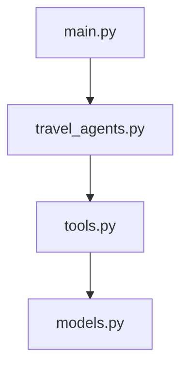

# Walkthrough: Modular Travel Assistant Refactoring

We have successfully refactored the Travel Assistant application into a modular architecture under `c:\Projects\travel_agent`.

## Architecture Overview

The monolithic script has been separated into four distinct, logical modules to improve readability, reuse, and maintainability:



### File Breakdown & Roles

1. **[models.py](file:///c:/Projects/travel_agent/models.py)**: Defines [FlightBookingRequest](file:///c:/Projects/travel_agent/models.py#L4) and [HotelBookingRequest](file:///c:/Projects/travel_agent/models.py#L9) as Pydantic models. This ensures inputs are validated before tool processing.
2. **[tools.py](file:///c:/Projects/travel_agent/tools.py)**: Holds the mock databases and asynchronous tool functions (`search_flights`, `book_flight`, `search_hotels`, `book_hotel`, `get_activities`).
3. **[travel_agents.py](file:///c:/Projects/travel_agent/travel_agents.py)**: Configures the four specialized agents (`Triage Concierge`, `Flight Specialist`, `Hotel Specialist`, and `Itinerary Specialist`) and defines their handoff transitions.
4. **[main.py](file:///c:/Projects/travel_agent/main.py)**: Orchestrates environment setup and starts the interactive CLI conversational loop using the `Runner`.

---

## Verification Results

### 1. Module Compilation
All modules compile cleanly without syntax errors or broken dependencies:
```powershell
.venv\Scripts\python -m py_compile models.py tools.py travel_agents.py main.py
```
*Result: Succeeded with no errors.*

### 2. Conversational CLI Startup
The main script successfully imports the modular agents and starts up:
```powershell
echo exit | .venv\Scripts\python main.py
```

*Output:*
```text
============================================================
          OPENAI AGENTS TRAVEL ASSISTANT CLI           
============================================================
Ready to plan your trip! Type 'exit' or 'quit' to end.
------------------------------------------------------------

[Agent: Triage Concierge] Hello! I am your travel assistant concierge. How can I help you plan your trip today?

You: Goodbye! Safe travels!
```
*Result: Verified successfully.*
